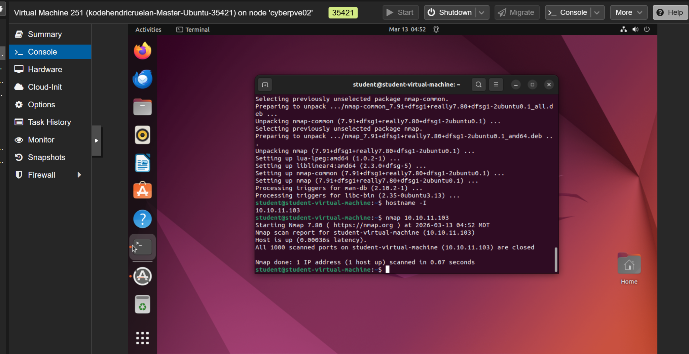
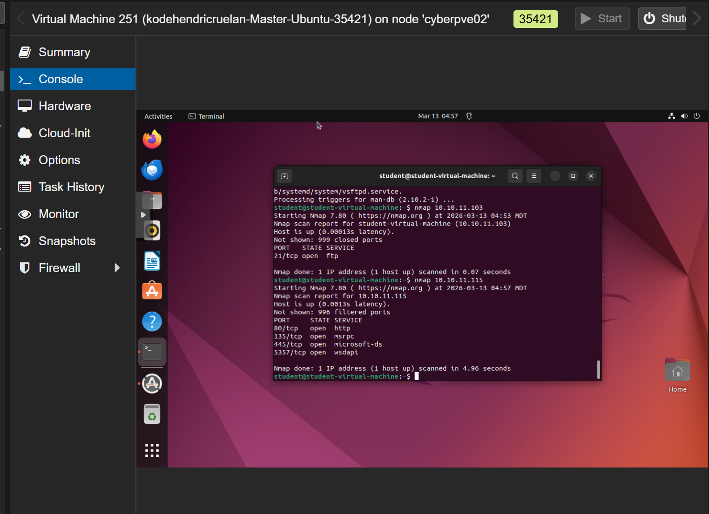
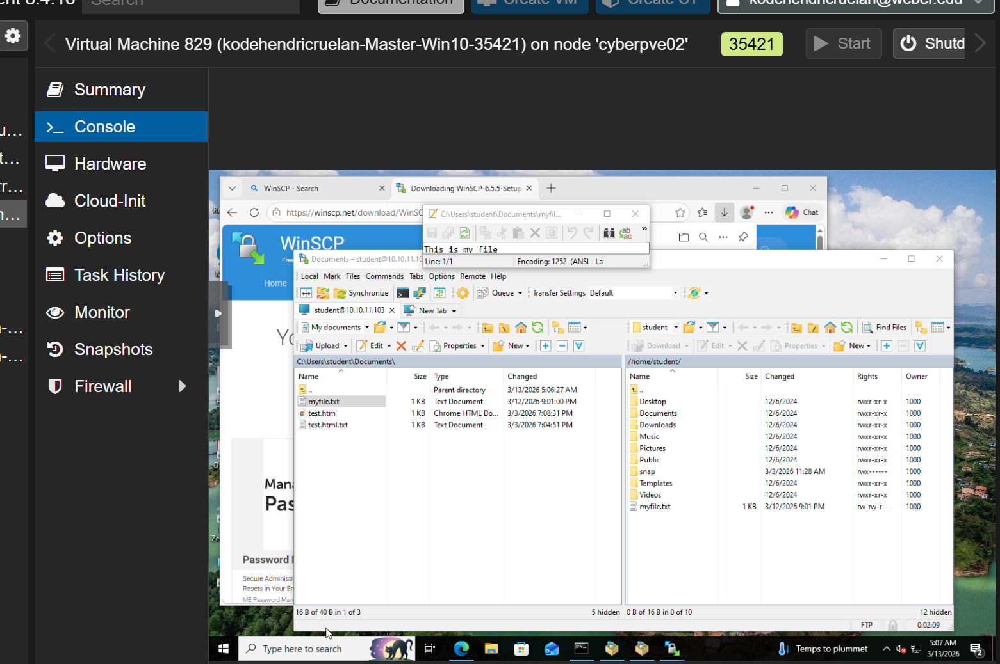
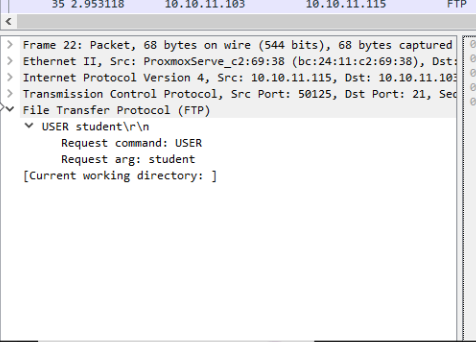
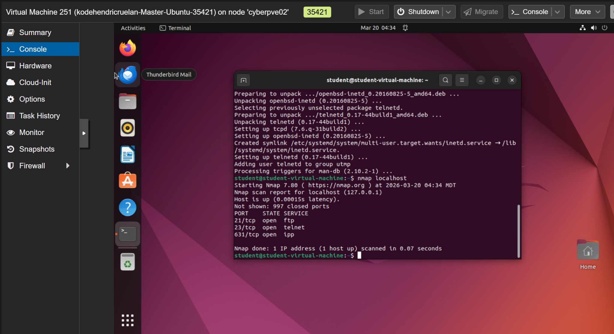
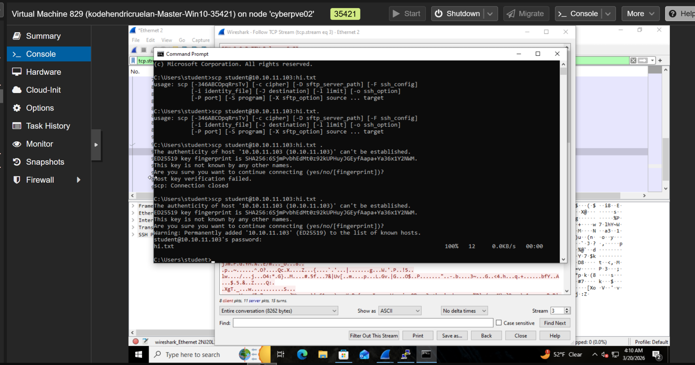
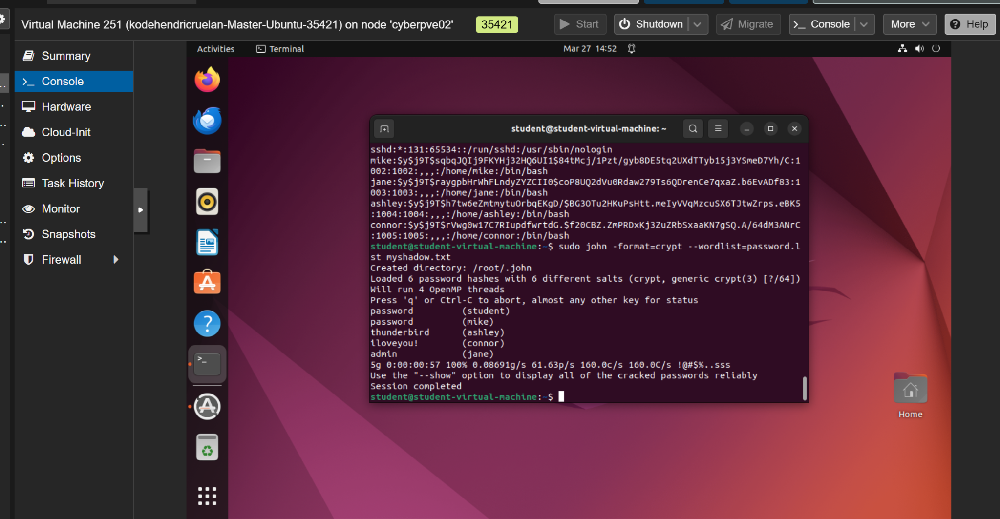
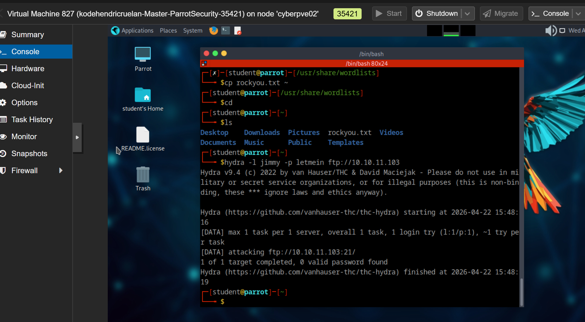
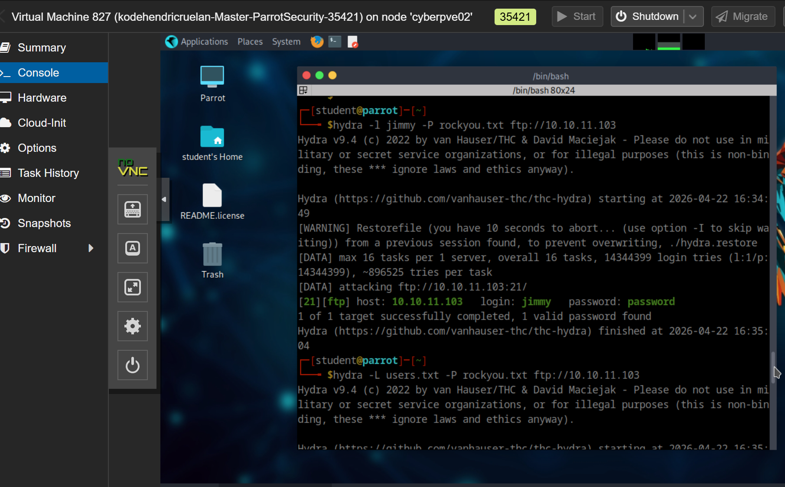
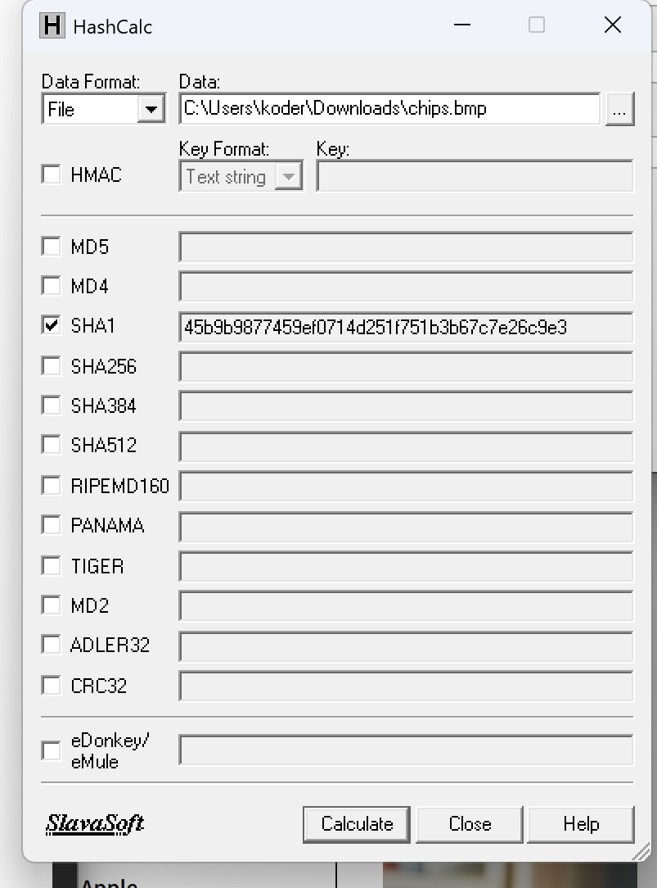

# Network Services & Password Security Lab

Hands-on cybersecurity lab exploring FTP, Telnet, SSH, password auditing, credential attacks, network traffic analysis, and file integrity verification in a controlled virtual environment.

## Overview

This project documents practical experience configuring network services, analyzing authentication traffic, investigating insecure protocols, and testing password security.

The objective was to understand how attackers exploit weak authentication and insecure communications, and how security professionals identify and mitigate these vulnerabilities.

All testing was conducted within an authorized educational lab environment.

## Lab Environment

- Proxmox Virtual Environment
- Ubuntu Linux Virtual Machine
- Windows 10 Virtual Machine
- Parrot Security OS
- Nmap
- Wireshark
- WinSCP
- THC Hydra
- John the Ripper
- HashCalc
- OpenSSH
- vsftpd
- Telnet

## Objectives

- Install and examine network services
- Identify open ports using Nmap
- Configure and test FTP communication
- Transfer files between Windows and Linux
- Analyze plaintext authentication traffic
- Compare Telnet and SSH security
- Perform password auditing using John the Ripper
- Demonstrate dictionary attacks against an authorized FTP service
- Verify file integrity using cryptographic hashing

---

## Lab Activities

### 1. Ubuntu FTP Service Configuration

Installed and configured the vsftpd FTP server on Ubuntu.

Used Nmap to identify the running FTP service and confirm that TCP port 21 was accessible.

### 2. FTP Port 21 Scanning

Performed an Nmap scan to investigate FTP availability.

Identified TCP port 21 as open and associated with the FTP service.

### 3. FTP File Transfer with WinSCP

Used WinSCP on Windows to connect to an Ubuntu FTP server.

Practiced navigating remote directories and transferring files between operating systems.

### 4. FTP Authentication Traffic Analysis

Captured FTP traffic using Wireshark.

Inspected FTP authentication packets to observe how usernames and passwords can be transmitted without encryption.

This demonstrated why traditional FTP is unsuitable for transferring sensitive credentials over untrusted networks.

### 5. FTP, Telnet, and SSH Service Configuration

Configured and examined multiple network services on Ubuntu.

Used Nmap to identify:

- TCP 21: FTP
- TCP 22: SSH
- TCP 23: Telnet

Compared the security implications of running encrypted and unencrypted remote access services.

### 6. Telnet Plaintext Traffic Analysis

Captured Telnet communication using Wireshark.

Examined TCP streams to understand how unencrypted terminal sessions can expose authentication information and commands.

This demonstrated the risks associated with plaintext remote access protocols.

### 7. SSH Encrypted Traffic Analysis

Established an SSH connection between Windows and Ubuntu.

Captured the connection using Wireshark and inspected the SSH protocol negotiation.

Observed that SSH encrypts session contents, preventing ordinary packet inspection from revealing transmitted passwords and commands.

### 8. Password Auditing with John the Ripper

Used John the Ripper to perform an offline password audit against lab-generated Linux password hashes.

Practiced:

- Examining Linux password hash formats
- Using password wordlists
- Identifying weak passwords
- Understanding the importance of password complexity

Successfully recovered several intentionally weak passwords in the lab.

### 9. FTP Dictionary Attack Testing

Used THC Hydra in an authorized lab to test FTP authentication against a password wordlist.

Observed how automated password guessing can identify accounts using weak credentials.

This exercise demonstrated the importance of strong passwords, authentication monitoring, and login protections.

### 10. FTP Credential Verification

Used Hydra to identify a valid username and password combination on the lab FTP server.

Verified the result through an authorized login and examined the remote system using basic Linux commands.

This demonstrated how weak authentication can lead to unauthorized access if appropriate security controls are absent.

### 11. File Integrity Verification with SHA-1

Used HashCalc to generate a SHA-1 hash for a file.

Examined how cryptographic hashes create a fingerprint of file contents and can be used to detect modifications.

Learned the importance of integrity verification in cybersecurity and digital forensics.

SHA-1 was used for educational purposes; SHA-256 or stronger algorithms are preferred for modern security applications.

---

## Security Concepts Demonstrated

### Insecure vs. Secure Protocols

| Protocol | Port | Encryption |
|----------|------|------------|
| FTP | 21 | No |
| Telnet | 23 | No |
| SSH | 22 | Yes |
| SFTP | 22 | Yes |

FTP and Telnet can expose sensitive information because they do not encrypt ordinary communication.

SSH and SFTP provide encrypted alternatives for remote access and file transfers.

### Password Security

Password auditing demonstrated how weak passwords can be discovered using dictionary-based techniques.

Defensive measures include:

- Strong, unique passwords
- Multifactor authentication where supported
- Login attempt restrictions
- Authentication logging and monitoring
- Disabling unnecessary services
- Secure password storage

### File Integrity

Cryptographic hashing helps detect changes to files by comparing calculated hash values.

This concept is important in software verification, incident response, and digital forensics.

---

## Skills Demonstrated

- Linux system administration
- Windows and Linux networking
- Network service configuration
- Nmap port scanning
- Wireshark packet analysis
- FTP file transfers
- SSH remote administration
- Telnet traffic inspection
- Password auditing
- Dictionary attack simulation
- Authentication security analysis
- Cryptographic hashing
- File integrity verification
- Virtual machine administration

## Key Takeaways

This project provided practical experience investigating network services, authentication security, and protocol-level communication.

By comparing FTP, Telnet, and SSH, I gained a better understanding of how encryption protects sensitive information.

Password auditing exercises demonstrated how weak credentials can expose systems to attacks and why secure authentication practices are essential.

The lab strengthened my foundational skills in network security, vulnerability assessment, and cybersecurity troubleshooting.

## Disclaimer

All security testing, password auditing, and credential attack simulations were performed in an authorized, controlled educational environment.

No unauthorized systems or accounts were targeted.
